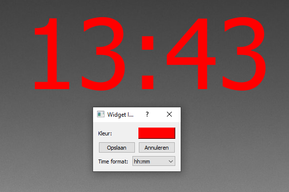

# Clock Widget

The Clock Widget displays the current time on your desktop.

## Features

- Displays current time
- Customizable time format (12-hour or 24-hour)
- Adjustable font color
- Resizable

## Configuration

You can configure the Clock Widget through the application settings:

1. Click on the Imolia Desktop Customizer tray icon
2. Select "Settings" from the menu
3. In the Settings window, go to the "Widgets" tab
4. Find the Clock Widget in the list and click on its settings button
5. In the settings dialog, you can adjust:
   - Time format
   - Font color

## Usage Tips

- Click and drag to move the widget around your desktop
- Click and drag the bottom-right corner to resize the widget

## Troubleshooting

If the widget is not displaying correctly:

1. Ensure that the widget is activated in the Imolia Desktop Customizer settings
2. Try restarting the application
3. Check the application logs for any error messages

For further assistance, please open an issue on our [GitHub repository](https://github.com/ImolaMedia/desktop-customization-tool/issues).