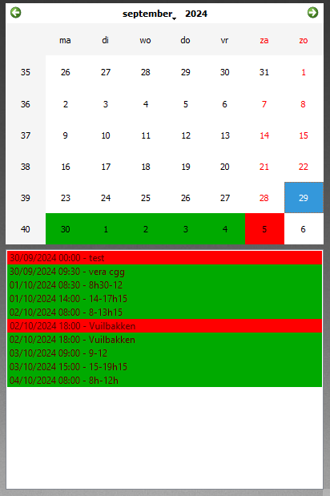

# Google Calendar Widget

This widget displays events from Google Calendar(s) on your desktop.



## Features

- Display upcoming events from multiple Google Calendars
- Customizable update interval
- Color-coded events based on calendar
- Configurable date format
- Customizable widget appearance

## Installation

1. Ensure you have the required dependencies installed:
   ```
   pip install icalendar recurring_ical_events requests PyQt5
   ```

2. Place the `google_calendar_widget.py` file in your Imolia Desktop Customizer Widgets folder:
   ```
   C:\Users\[YourUsername]\Documents\Imolia Desktop Customizer Widgets\
   ```

3. Restart the Imolia Desktop Customizer application or refresh the widget list.

## Configuration

To configure the widget,  right-click on tray icon and select "Settings". You can adjust the following:

- iCal URLs: Add the iCal URL for each Google Calendar you want to display
- Update Interval: Set how often the widget should fetch new events (in hours)
- Number of Events: Set the maximum number of events to display
- Date Format: Choose between dd/mm/yyyy, mm/dd/yyyy, or yyyy-mm-dd
- Color Settings: Customize the appearance of the widget and calendar

## Usage

- Click on a date in the calendar to view events for that specific day
- The list below the calendar shows upcoming events
- Events are color-coded based on their source calendar

## Troubleshooting

If you encounter any issues:

1. Ensure your iCal URLs are correct and accessible
2. Check your internet connection
3. Verify that you have the latest version of the widget and all dependencies

## Support

For support, please open an issue on the [GitHub repository](https://github.com/ImoliMedia/desktop-customization-tool) or contact support@imoliamedia.be.

## License

This widget is part of the Imolia Desktop Customization Tool and is licensed under the GNU General Public License v3.0.