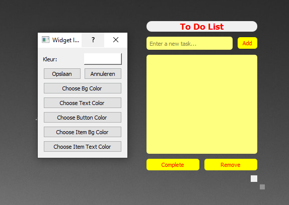

# Modern To-Do Widget

The Modern To-Do Widget is a sleek, user-friendly task management tool for your desktop.

## Features

- Add, edit, and remove tasks
- Mark tasks as complete
- Customizable color scheme
- Resizable widget

## Configuration

You can configure the Modern To-Do Widget through the application settings:

1. Click on the Imolia Desktop Customizer tray icon
2. Select "Settings" from the menu
3. In the Settings window, go to the "Widgets" tab
4. Find the Modern To-Do Widget in the list and click on its settings button
5. In the settings dialog, you can adjust:
   - Background color
   - Text color
   - Button color
   - Item background color
   - Item text color

## Usage Tips

- Click the "Add" button to add a new task
- Double-click on a task to edit its text
- Use the "Complete" button to mark a task as done
- Use the "Remove" button to delete a task
- Click and drag to move the widget around your desktop
- Click and drag the bottom-right corner to resize the widget

## Troubleshooting

If the widget is not displaying correctly:

1. Ensure that the widget is activated in the Imolia Desktop Customizer settings
2. Try restarting the application
3. Check the application logs for any error messages

For further assistance, please open an issue on our [GitHub repository](https://github.com/ImolaMedia/desktop-customization-tool/issues).