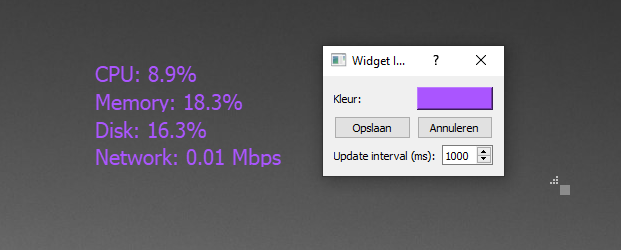

# System Monitor Widget

The System Monitor Widget provides real-time information about your system's performance directly on your desktop.

## Features

- Displays CPU usage
- Shows memory (RAM) usage
- Monitors disk usage
- Tracks network activity
- Customizable update interval
- Adjustable font color
- Resizable widget

## Configuration

You can configure the System Monitor Widget through the application settings:

1. Click on the Imolia Desktop Customizer tray icon
2. Select "Settings" from the menu
3. In the Settings window, go to the "Widgets" tab
4. Find the System Monitor Widget in the list and click on its settings button
5. In the settings dialog, you can adjust:
   - Update interval (how often the information refreshes)
   - Font color

## Usage Tips

- Click and drag to move the widget around your desktop
- Click and drag the bottom-right corner to resize the widget
- The widget updates automatically based on the set interval

## Troubleshooting

If the widget is not displaying correctly or showing accurate information:

1. Ensure that the widget is activated in the Imolia Desktop Customizer settings
2. Try restarting the application
3. Check that the application has the necessary permissions to access system information
4. Verify that no other software is conflicting with system monitoring
5. Check the application logs for any error messages

For further assistance, please open an issue on our [GitHub repository](https://github.com/ImolaMedia/desktop-customization-tool/issues).

## Note on Resource Usage

The System Monitor Widget itself uses a small amount of system resources to gather and display information. If you notice any performance impact, try increasing the update interval in the widget settings.